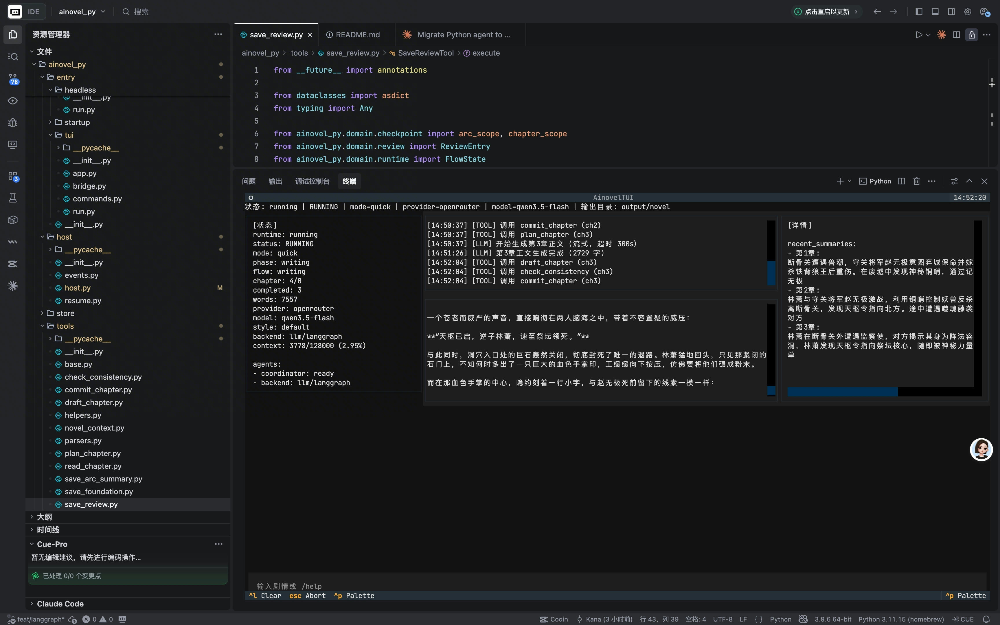

# ainovel-py

一个面向长篇小说创作的多模块项目，当前由三个主要部分组成：

- **frontend-web**：前端工作台
- **java-platform**：平台层 API，当前主要承接 story 元数据与基础平台接口
- **ainovel_py**：Python Agent Runtime，负责写作运行时、workspace、上下文组装、评审与流式事件输出



## 当前架构

```text
frontend-web
  ├─ /api/v1/...      -> java-platform (Spring Boot)
  └─ /internal/v1/... -> ainovel_py internal API (FastAPI)

java-platform
  └─ stories / health / 平台层基础能力

ainovel_py
  └─ runs / workspace / SSE stream / Agent orchestration / local store
```

### 前后端职责边界

#### Frontend
前端负责工作台 UI、故事管理入口、workspace 编辑与运行状态展示。

当前 API 分流如下：

- **Stories 相关接口走 Java**
  - 见 [frontend-web/src/lib/api/stories.ts](frontend-web/src/lib/api/stories.ts)
- **Runs / Workspace / Stream 相关接口走 Python**
  - 见 [frontend-web/src/lib/api/runs.ts](frontend-web/src/lib/api/runs.ts)
  - 见 [frontend-web/src/lib/api/workspace.ts](frontend-web/src/lib/api/workspace.ts)
  - 见 [frontend-web/src/lib/api/pythonClient.ts](frontend-web/src/lib/api/pythonClient.ts)
- Vite 开发代理：
  - `/api` -> `127.0.0.1:8080`
  - `/internal` -> `127.0.0.1:8000`
  - 见 [frontend-web/vite.config.ts](frontend-web/vite.config.ts)

#### Java Platform
Java 层当前是**平台层后端**，主要负责：

- stories 基础 CRUD
- health 等平台基础接口
- 后续可扩展的平台能力：账号、权限、审计、持久化治理、统一 API 门面

当前已确认的 HTTP 入口：

- [java-platform/src/main/java/com/ainovel/platform/interfaces/http/StoryController.java](java-platform/src/main/java/com/ainovel/platform/interfaces/http/StoryController.java)
- [java-platform/src/main/java/com/ainovel/platform/interfaces/http/HealthController.java](java-platform/src/main/java/com/ainovel/platform/interfaces/http/HealthController.java)

当前 Java **不再承担 Python Agent 的运行时转发层**。

#### Python Agent Runtime
Python 层是当前的**Agent 运行时核心**，负责：

- run 创建、查询、暂停、恢复、取消
- workspace intent / run bridge / reference snapshot
- SSE 流式事件输出
- LangGraph 编排
- 上下文装配
- chapter draft / consistency check / commit / review / rewrite
- 本地持久化与断点恢复

运行入口：

- [ainovel_py/entry/internal_api/run.py](ainovel_py/entry/internal_api/run.py)
- [ainovel_py/internal_api/routes.py](ainovel_py/internal_api/routes.py)

## Python Runtime 主流程

当前 Python 运行时围绕章节级工作流组织。

### 编排入口

关键文件：

- [ainovel_py/internal_api/app.py](ainovel_py/internal_api/app.py)
- [ainovel_py/internal_api/service.py](ainovel_py/internal_api/service.py)
- [ainovel_py/host/host.py](ainovel_py/host/host.py)
- [ainovel_py/agents/build.py](ainovel_py/agents/build.py)
- [ainovel_py/agents/orchestrator/langgraph/core.py](ainovel_py/agents/orchestrator/langgraph/core.py)
- [ainovel_py/agents/orchestrator/langgraph/nodes/core.py](ainovel_py/agents/orchestrator/langgraph/nodes/core.py)

### 典型 LangGraph 节点

- `load_runtime_context`
- `novel_context`
- `plan_chapter`
- `generate_draft`
- `commit_chapter`
- `review`
- `rewrite`
- `arc_summary`
- `volume_summary`
- `expand_arc`
- `checkpoint`
- `finish`

### 真实写章主链路

1. `draft_chapter`
2. `check_consistency`
3. `commit_chapter`

## Python 如何参考前文

当前续写不是简单把前文章节全文塞回模型，而是采用**结构化前文状态 + 摘要恢复**的方式。

核心链路：

1. `novel_context` 读取前文上下文
2. `ContextManager` 将上下文压缩为适合写作的 prompt 片段
3. `plan_chapter` / `generate_draft` 使用这些上下文生成下一章
4. `commit_chapter` 将本章沉淀为 summary / timeline / relationship / foreshadow / state changes，供后续章节使用

关键文件：

- [ainovel_py/tools/novel_context.py](ainovel_py/tools/novel_context.py)
- [ainovel_py/agents/context_manager.py](ainovel_py/agents/context_manager.py)
- [ainovel_py/agents/runner.py](ainovel_py/agents/runner.py)
- [ainovel_py/tools/commit_chapter.py](ainovel_py/tools/commit_chapter.py)

## 目录说明

| 路径 | 作用 |
| --- | --- |
| `frontend-web/` | React 前端工作台 |
| `java-platform/` | Spring Boot 平台层 API |
| `ainovel_py/internal_api` | Python Internal API、RunService、worker、routes |
| `ainovel_py/host` | 运行生命周期管理、事件与快照 |
| `ainovel_py/agents` | LangGraph 编排、上下文构建、运行器 |
| `ainovel_py/tools` | plan / draft / commit / review / summary 等业务动作 |
| `ainovel_py/store` | progress / checkpoint / runtime / drafts / world state 持久化 |
| `ainovel_py/domain` | runtime / review / checkpoint / writing 等领域模型 |
| `ainovel_py/assets` | prompts / references / styles |
| `tests/` | Python 运行时相关 smoke / e2e / internal api 测试 |

## 本地运行

### 1. 启动 Java Platform

```bash
cd java-platform
mvn spring-boot:run
```

默认提供：

- `GET http://127.0.0.1:8080/api/v1/health`
- `GET/POST/DELETE http://127.0.0.1:8080/api/v1/stories`

### 2. 启动 Python Internal API

```bash
export AINOVEL_INTERNAL_API_HOST=127.0.0.1
export AINOVEL_INTERNAL_API_PORT=8000
export AINOVEL_INTERNAL_API_TOKEN=secret-token
python -m ainovel_py.entry.internal_api.run
```

健康检查：

```bash
curl -H "Authorization: Bearer secret-token" \
  http://127.0.0.1:8000/internal/v1/health
```

创建 run：

```bash
curl -X POST http://127.0.0.1:8000/internal/v1/runs \
  -H "Authorization: Bearer secret-token" \
  -H "Content-Type: application/json" \
  -d '{
    "run_id": "run_demo",
    "story": {
      "story_id": "story_demo",
      "title": "雨夜觉醒",
      "premise": "主角在雨夜觉醒并卷入阴谋。",
      "style": "default"
    },
    "execution": {
      "provider": "openrouter",
      "model": "qwen3.5-flash",
      "context_window": 128000
    },
    "input": {
      "mode": "start",
      "prompt": "写一部雨夜觉醒、阴谋、长篇网文风格小说。"
    },
    "storage": {
      "kind": "local",
      "base_path": "output/run_demo"
    }
  }'
```

### 3. 启动前端

```bash
cd frontend-web
npm install
npm run dev
```

开发时默认代理：

- `/api` -> Java `8080`
- `/internal` -> Python `8000`

## 持久化

Python Runtime 当前默认使用**本地文件持久化**。常见产物包括：

- `meta/progress.json`
- `meta/checkpoints.jsonl`
- `meta/runtime/queue.jsonl`
- `meta/pending_commit.json`
- `drafts/*.draft.md`
- `chapters/*.md`
- `summaries/*.json`
- `reviews/*.json`
- timeline / relationships / foreshadow / state changes

这使系统支持：

- 中断恢复
- checkpoint 恢复
- 事件回放
- review/rewrite 队列持续推进

## 配置

Python Runtime 的最小配置示例：

```json
{
  "provider": "openrouter",
  "model": "qwen3.5-flash",
  "providers": {
    "openrouter": {
      "api_key": "YOUR_API_KEY",
      "base_url": "https://example.com/compatible-mode/v1",
      "models": ["qwen3.5-flash", "qwen3.5-plus"]
    }
  }
}
```

Java Platform 配置见：

- [java-platform/src/main/resources/application.yml](java-platform/src/main/resources/application.yml)

## 测试

### Python Runtime

关键验证：

- [tests/langgraph_backend_smoke.py](tests/langgraph_backend_smoke.py)
- [tests/langgraph_nodes_smoke.py](tests/langgraph_nodes_smoke.py)
- [tests/langgraph_e2e_smoke.py](tests/langgraph_e2e_smoke.py)
- [tests/langgraph_resume_smoke.py](tests/langgraph_resume_smoke.py)
- `tests/internal_api_*`

### Java Platform

```bash
mvn -q -f java-platform/pom.xml test
```

## 当前架构现状与后续方向

当前现状：

- 前端同时连接 Java 与 Python
- Java 承担平台层基础接口
- Python 承担 Agent 运行时核心能力

如果后续继续演进，推荐方向是：

- **Java 专注平台层能力**：用户、权限、审计、统一 API、平台数据模型、持久化治理
- **Python 专注 Agent 能力**：写作编排、上下文管理、评审、重写、流式生成、模型适配

当前 README 描述的是**现在已落地的结构**，不是未来的理想单后端形态。

## 建议阅读顺序

### 先看平台边界

1. [frontend-web/src/lib/api/stories.ts](frontend-web/src/lib/api/stories.ts)
2. [frontend-web/src/lib/api/runs.ts](frontend-web/src/lib/api/runs.ts)
3. [frontend-web/src/lib/api/workspace.ts](frontend-web/src/lib/api/workspace.ts)
4. [java-platform/src/main/java/com/ainovel/platform/interfaces/http/StoryController.java](java-platform/src/main/java/com/ainovel/platform/interfaces/http/StoryController.java)
5. [ainovel_py/internal_api/routes.py](ainovel_py/internal_api/routes.py)

### 再看 Python Runtime 内核

1. [ainovel_py/internal_api/app.py](ainovel_py/internal_api/app.py)
2. [ainovel_py/internal_api/service.py](ainovel_py/internal_api/service.py)
3. [ainovel_py/host/host.py](ainovel_py/host/host.py)
4. [ainovel_py/agents/build.py](ainovel_py/agents/build.py)
5. [ainovel_py/agents/orchestrator/langgraph/core.py](ainovel_py/agents/orchestrator/langgraph/core.py)
6. [ainovel_py/agents/orchestrator/langgraph/nodes/core.py](ainovel_py/agents/orchestrator/langgraph/nodes/core.py)
7. [ainovel_py/tools/commit_chapter.py](ainovel_py/tools/commit_chapter.py)
8. [ainovel_py/store/store.py](ainovel_py/store/store.py)
